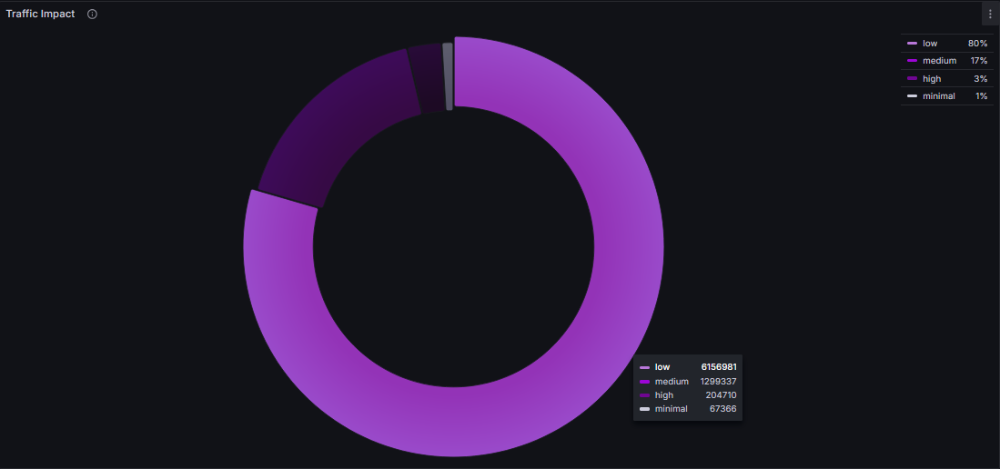
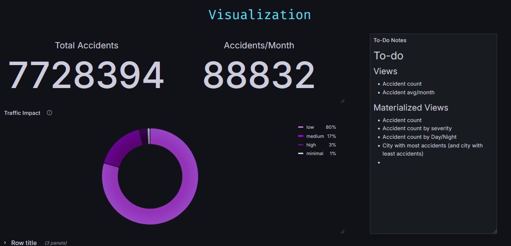
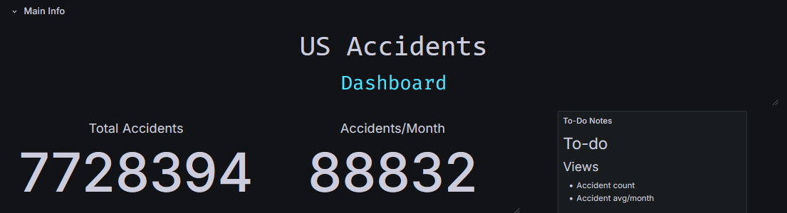
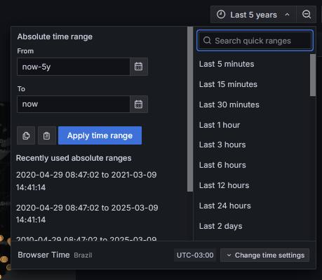

<p class="emphasized">This project showcases experience in designing and organizing visualizations in Grafana dashboards. It also reflects an understanding of UX in data visualization and how to make complex data readable at a glance.</p> 


# Grafana Dashboard Visualizations

Grafana is a tool for data monitoring and visualization. Most people wouldn't really use it for BI (Business Intelligence) or analysis, but as [this blog post on Grafana's website](https://grafana.com/blog/2022/05/31/grafana-for-business-intelligence-how-grafana-labs-uses-dashboards-for-more-than-observability-data/) shows, (biased much yeah I know)  you definitely *can* do so, and that's (partly) what this project is about.

I'm gonna zoom in on some of the visualizations I made for my "US Accidents Dashboard" project, and explain part of the thought process behind them, as well as some difficulties I encountered (and some useful solutions)  

<p class="emphasized">Some notes on the things I learned will be written down at the end of the document.</p> 


## Traffic Impact Rates




Pretty simple stuff at first. I had a column representing the severity of each of my ~7 million accidents, and I wanted to see the severity distribution among the entire database.

My first instinct was to do `SELECT COUNT(*) FROM accidents GROUP BY severity`, which wouldn't be wrong, but I needed each severity group to have a different name (so I could then edit them separately on Grafana, change colors, labels and so on).

I then thought about `UNION`, but I ended up going with multiple `COUNT(*) FILTER (WHERE severity = x) AS yyy` as I noticed it'd be a quicker query.

Still though, when my Grafana dashboard loaded, this visualization would take a huge time to load (as it'd be querying the entire database). So, I used something called Materialized Views.

A Materialized View basically:
- asks you to create a query
- runs said query when it is created
- saves the result of the query, and when you call it, it simply gives you that result. Instantly. 
- Later on, you can REFRESH the Materialized View to update the data it is querying.

This fixes our "huge loading time" problem (as the querying will be done only once, when we create the MV), and will be used in lots of our other dashboard visualizations along the way.

## General Design Pointers

<p class="emphasized">I thought about talking about each Dashboard View's design specifically, but I noticed a lot of the design ideas repeat again and again for most visualizations I'm making. So, instead, I'm going to give you some general pointers about their visual design.</p> 


### 1. Transparent Backgrounds

<figure class="figure">
  <br>
  <figcaption>Non-transparent background being used for detached notes</figcaption>
</figure>


This might be more of a me thing, but I really dislike when I can see the bounding boxes of the data. There's obviously some use in it depending on your goal, but in general, I want the data to be seamless. Leave most of the data with a transparent background, and make "non transparent background" a choice for when you want whatever you are showing to be "outside" of the dashboard's main thing.


### 2. Minimalist

Showing as much information as possible with as little text as possible. There obviously can be text here and there to explain stuff that needs explaining, but if there's any big wall of text it should be either:
 1. Using a non-transparent background, shoved to the side to show that it is "extra" or 
 2. hidden inside some info symbol the user has to hover over.

### 3. Personalized

Make every visualization's info very specifically personalized.

An example of this is using the "Override" option to be very specific with what names you want to display for certain variables (like changing "accidents_per_month" variable name into "Variable/Month") or changing a variable's color scheme - so you then have a graph with specific shades of purple instead of a bunch of different colors.

### 4. Interactive / Dynamic

Generally the great thing about Dashboards is that you can make it extremely easy to query specific data.
I'm not great at this one, and (at least at the time of writing this) this feature in my US Accidents dashboard is still a work in progress, but you should ideally make it so the dashboard lets the user select ways to query info.

One example of this is using Grafana's built in "Time Range Picker" (and using it in your queries). Another example is letting the user zoom in on a map to better view info on it. Or change one visualization's info based on what the user clicked on another view (and make both clearly connected)


## HTML (Text Visualization)




While I was messing around with good ways of showing off the title of the dashboard, I stumbled onto something pretty neat - I noticed that Grafana's Text Visualization accepts not only markdown, but also HTML.

I've yet to explore a lot of how I could use this (I'm betting I could display data in some very fun ways with this), but for now I'm using some *herokuapp* stuff to display the title and the changing blue text you can see on the gif up there.

One thing I love doing when messing around with HTML, especially when it comes to "making a certain part of my project a bit prettier", is just asking ChatGPT to write the HTML+CSS for me (and then re-write the text inside it). I had absolutely no clue that this blue changing text thing existed until I asked ChatGPT to make me some "modern looking css for blablabla". I'm serious ChatGPT is the king of low-level CSS - and that, fortunately, is all we need.


## Time Range

Grafana has this neat little thing at the top of its dashboards called time picker:



This is super useful for when you are handling time series data (pretty much what Grafana is made for). It lets the user pick the time-range they want to view.

Now, one thing to keep in mind is this doesn't automatically change your queries to filter date/time. You need to do it yourself, making use of the time-picker variables grafana has built in: `${__from:date:iso}` and `${__to:date:iso}`. Your query should look something like this:

```
SELECT latitude, longitude, temperature, start_time AS "time" FROM accidents 
WHERE start_time BETWEEN '${__from:date:iso}' AND '${__to:date:iso}'
ORDER BY start_time ASC LIMIT 500 
```

Also, depending on what you are querying, do *not* forget to limit the amount of rows you'll get. Since the user controls what time range they want, they can try to query all of your database, which isn't always desirable.


# Main Takeaways

So, if you read this far (or if you skipped to the end 'cause yeah fair enough) the main stuff I'd take away from here is
- Grafana actually *can* be used for Business Intelligence, and it might be good to implement it in your work as such if you already use it for monitoring and data visualization.
- Use Materialized Views for stuff that doesn't need to be updated every minute/second/access
- Use HTML+CSS on Text Visualizations (LLM models like ChatGPT or Copilot are pretty good at this.)
- Don't be afraid to edit stuff case-by-case (especially colors, names, etc). Not everything needs to be ready straight from the database.
- You can rely on the time range functionality that Grafana already provides if your data is a time series to allow the end-user to display info about only specific timeframes.

# Future
I'm already doing a "next steps" section on my "US Accidents" post, so I'll just leave you with some stuff that I want to explore in the future:

- I wonder how far you can push the HTML/CSS in the Text Visualization (like, does it break if I try to put an interactable widget iframe in there?).
- I really need to explore the sharing and exporting options for visualizations. Especially because it would (I assume?) allow me to put some of those visualizations *in this website*, so you (invisible, probably non-existent reader) could mess around with them yourself.
- I have read a lot about people using the Grafana variables to insane degrees. It's something I want to study more later.

