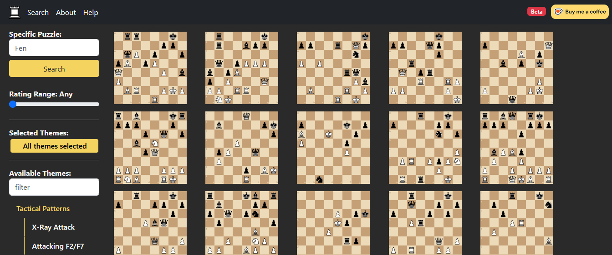
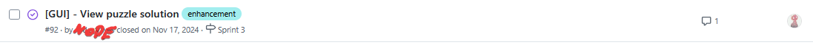
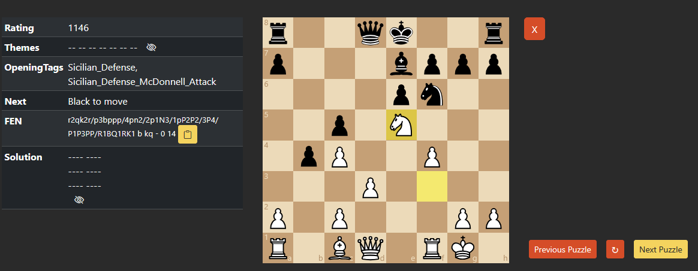
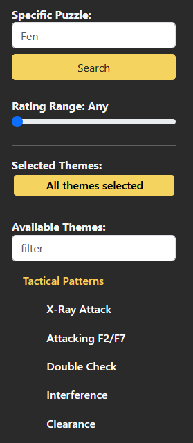

# Chess Puzzle Hub

This project showcases knowledge in building and working with REST APIs as well as frontend work using Angular.
 

This is a little side project me and some friends called ChessPuzzleHub:

I think the concept is honestly pretty simple. We didn't know any very good chess puzzle websites, so we decided to create one ourselves.

I actually got into this project when the development process was already partly underway.

This post won't really be like any of my other posts. Usually I have some theory or concept I want to illustrate. Here, though, I'll mostly just be talking about our process, and the different parts of this website.

> Also, while this website used to have a URL and was run on an AWS compute instance, the price to keep that up proved a bit higher than we were making through donations, so we mostly just scrapped it. Bummer but it what it is.

---

## Development Process

Our development process was pretty simple. For starters, we had a very basic process where one of the co-developers (let's call him Team Lead) wrote some issues on GitHub, and I grabbed some that I felt comfortable working on in the week.

<figure class="figure">
   
  <figcaption>Example of one of our issues</figcaption>
</figure>

Later on we started having weekly meetings to see where everyone was at and to talk about which issues would be going to whom. Since it was a side project for all of us everything was very laid-back.

These issues would cover pretty much everything we'd work on. When someone thought about a way to improve the website, or to fix a bug, we'd write it down as an issue that week, and later on one of us would grab the issue for themselves and work on it during the week. Usually we'd take multiple issues each so we could have more stuff to work on (so as to not get too burnt out by working on a single thing)

Honestly? It was a bit messy but I really liked doing things in that way. Everyone was always up to speed, we could talk about the stuff we were excited about and our future plans for the project. Was always a highlight of my week.
 

---

## Features

There's some stuff I want to cover here:

- Puzzle Screen
- Sidebar
- Homepage
- Help page

### Puzzle Screen
When you were to go into the Search Page and click on one of the puzzles, this is what you'd be met with:

On this screen you could play out the game, as well as look at some info about the puzzle on the left side (as well as look at the solution for the puzzle.)

Here you play out the puzzle like you would in a normal chess website like chess.com

Needless to say, this screen will fetch the data about the puzzles from our database and the frontend will handle all the moves and etc.

 This was actually a pretty neat thing I worked on, the way we passed the chess puzzles from the backend to the frontend was actually super data-heavy, as we were passing all the image (mounted through .svgs) to the frontend. Later on we found out JS has a library for working with chess. That library actually did not work for us, but one of the forks of that library did, and so we started using that. 

--- 

### Sidebar

Honestly the most interesting part of this project.

Here you can select a puzzle in lots of ways.
  
The first and least useful one is by inserting the FEN of the puzzle. I say least useful because you can only really get the FEN of a puzzle if you already saw the puzzle somewhere. We knew no one would use this, but that was alright. It was pretty useful for debugging some of our weirder puzzles
  
After that you get to the interesting stuff, and what honestly inspired us to make this website. You can filter Puzzles in different ways.
  
You can filter by a rating range - this has some interesting stuff I'll talk about later - which is very nice since it allows you to play puzzles you actually think you can solve. 
 
You can also filter by puzzle Theme. This is very nice as it lets you decide what you want to study in that specific moment. There are <i>lots</i> of themes. Everything from Openings to types of checks to ending lengths and so on. Was very fun to search the more.. unusual puzzles out there. You could find some wild stuff like "fork Pin on an Opening with En Passant" and it would find you that puzzle if it exists - and as I just checked, yeah, it does.
  
All of those themes, when selected, were filtered through our database, and after filtered were served to the frontend.

  

---

## Homepage and Help Page

Both of those were pretty simple. 

Honestly I'm not going to leave an image of them here because you don't need one. They had some information about the website, as well as a link to a google form for feedback (which we honestly didn't get any), and a link to a Ko-Fi Donations page, which did manage to keep the website sustaining itself for quite some time. I think a couple of months before we eventually really did have to shut it down.

 I think one thing I did manage to understand better is the power that donations have to keep a website like this running. Especially when you take into account different currencies, sometimes even a small 5 dollar donation can get the website sustaining itself for a while. Gotta admit not a thing I thought I'd learn with this project

---

 For now I'm gonna leave it at that, I might come back to write more stuff here later, especially because I kinda do want to cover a bit about our plans for the future as well as our use of Apache Airflow to automate some neat stuff.
