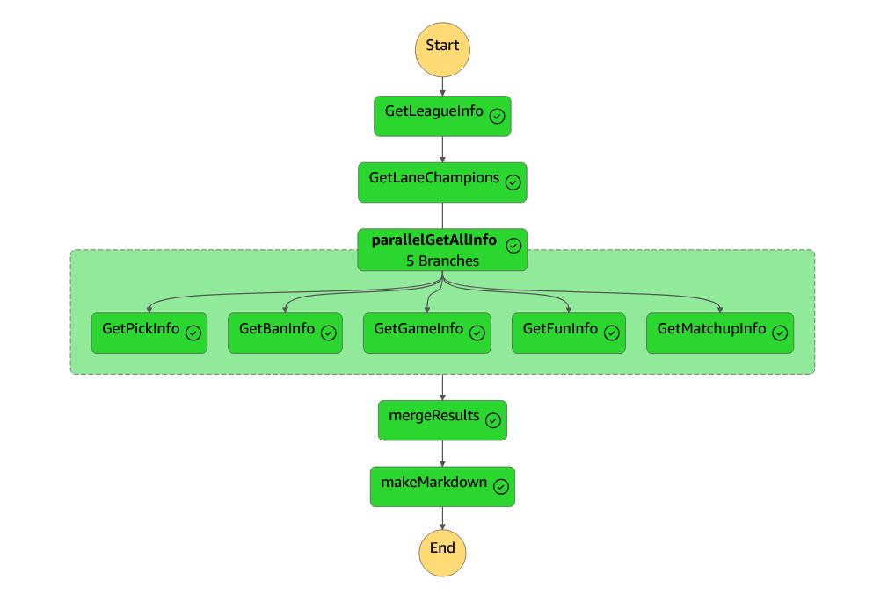
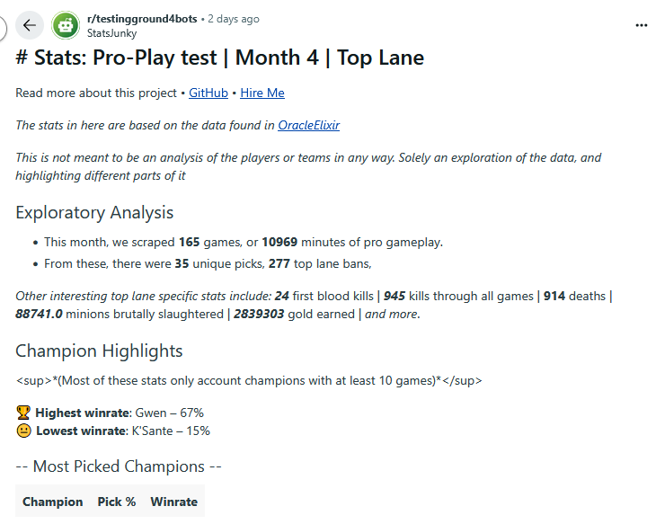

<p class="emphasized">This project showcases knowledge in data scraping and analysis using Python and Pandas. It also demonstrates uses of AWS Lambda, AWS State Machine and AWS EventBridge.</p> 
<p class="emphasized">To properly handle all these technologies I used Serverless Framework, a program built to streamline setting up serverless technology.</p>

# League of Legends Esports Data Pipeline

In Esports, data on professional play is not only interesting, but can contain significant information as to why certain teams win, lose, the patterns that arise in play, and so on.

Due to this, I decided to create a data pipeline that scrapes data from certain sources and automatically uploads said data into my own database, all for free, all automated, and with the goal of visualizing that data later on another software. (Most likely Grafana)

<sub>*~Edit: This is not an accurate description of this project any longer. I'm going to leave it here because I think it's interesting to see how the project changes and grows as ideas sprout and goals shift later in the project's lifecycle.*</sub>


## 1. Exploring sources
The first thing I like doing when working on an ETL project by myself is exploring the different venues I have of obtaining data.

In this case, after some research, there were a few to choose from:
- [Pro Play Fandom Wiki](https://lol.fandom.com) - Web-Scraping
- [Games of Legends](https://gol.gg) - Web-Scraping
- Github Projects for esports APIs - there were more than one, most of them, as far as I understand, not up to date
- [Oracle's Elixir](https://oracleselixir.com) - Freely available data in form of csv

<sub>*~Edit: In hindsight, I might have gotten a lot of leeway from searching up stuff on database websites like Kaggle. Luckily Oracle's Elixir is likely still better than what I would have found on those.*</sub>


This demonstrates a bit why it is so important to search for good sources when working on ETL. I could have spent hours/days of work setting up a proper web scraper that would get me *some* information. Oracle's Elixir has all that information open-to-use, for free, in the click of a button.


## 2. Exploring the Data

It's nice to know the general structure of the data we are working with. Looking at it, running some basic exploratory analysis stuff, and reading documentation can really help with that. (Oracle's Elixir has some pretty neat stuff for reference as well).

Just as an example of something you can notice while exploring the dataset, You'd imagine this .csv would have data for each game, including red/blue teams on each row. That is not the case. There is one row for each player in a game, and 2 extra rows for red/blue teams. Meaning, you have 12 rows per game (in other words, a lot of repeated information).

After some time looking through the data and doing the usual exploratory analysis stuff (check number of rows, check amount of null data, try to understand why there's so much null data, think about treating the data, decide against it, etc etc etc), I got pretty hooked into some different info I could gather.

<sub>~*Edit: Hey, this is future me editing this part of the document. I noticed I never really talked about the tools I'm using to do all this, but mostly this first half of the process uses Python and Pandas DataFrames.*<sub>

### 2.1 Having some fun
So, as a nice little treat for myself, I let myself do some fun experiments. Not too much stuff, and not really presentable, but just play around with the data, see what interesting things I could gather.

So, let's play a game! I'll ask you a question, and you have to guess the answer.
(I know, this is a fuck*d way to set up a spoiler tag. I'm sorry. Markdown + pre-visualization on VSCode have my hands tied here. Click the arrow to reveal the answer.)

---
<details>
  <summary>How many champions were not played at all? (globally) </summary>
- 4 champions. I'd bet a dime that Fearless Draft affected this number somewhat.
</details>
<details>
  <summary>Can you name two of them?</summary>
- Here's the entire list: Briar, Evelynn, Fizz, Nunu
</details>

--- 
**Let's try something else**, I'll narrow it down to LCK specifically.

<details>
  <summary>Most played champion?</summary>
  - Xin'zhao
</details>
<details>
  <summary>Least played champion?</summary>
  - Trick question :P LCK has a lot of champions that weren't picked at all
</details>
<details>
  <summary>Longest game?</summary>
  - 3039.
  ... Okay Imma stop with the jokes. It's 3039 seconds. I took about half an hour to figure this out. Yes I am a bit dull sometimes. It converts to ~50 minutes.
</details>
<details>
  <summary>Shortest game?</summary>
  - 22 minutes. Honestly expected it to have been quicker.
</details>


Kay, enough fun, let's go back to still fun but a bit less so.

## 3. Deciding what we want
The dataset isn't huge, so we *could* dump it all on a DynamoDB table and be done with it. But that wouldn't be that useful. DynamoDB from what I understand is not very good for analysis.

For enterprises and such, this step is easier. You generally get data for a specific goal (either there's a problem you all know and want to solve, or there's an issue on github detailing what we need, etc).

For personal projects, this is weirder. Since I can choose to turn this into whatever I want, knowing exactly what data I want to prioritize (and what tools I want to use / in what way I want to use them) gets hard.

With this goal in mind, I did some things:
- Searched similar projects
- Asked ChatGPT (unreasonably good at sparking some ideas in your head)
- Just walked around and thought about it


After all that, I ended up deciding my ultimate goal is to create something that could be used to automatically give me a reddit post of "highlights, stats, and fun-facts" about each week in the LCK.

So, I'll:

- Get info on all Tier 1 Pro games (that includes LCK, LPL, LTA, LEC (and I'm not gonna include LCP because I don't know anyone from there)) 
- get info of the *teams*, and later on specific players.
- I want draft info (so, champions, bans, side...),
- General in-game info (length, amount of kills per team, etc)
- General out-of-game info (Team name, when it happened, what patch, etc)

One thing to keep in mind is that I decided to make two different DBs for this stuff. It's weird but I have a good reason for it.

First of all, I want all of this to be free. No computer of mine running 24h/day doing cron jobs, no "using my machine to run postgresql database that I'll inevitably forget about and not leave enough disk space on and will eventually break down. . ." you get the idea.

Second, Oracle's Elixir's database has a lot of repeated stuff. Thats not a problem for them. It's not a gigantic amount of data, the repeatedness isn't completely useless (e.g. I can easily search for "Chovy's games" and find how well his entire team was doing without having to also query the game itself). For us though, it is annoying. Because we want a clean database with very specific goals, that will make it much easier to query later (and we are *a tiny little small bit* worried about disk space, as we'll use cloud to store stuff, and I'll *hopefully* leave this kiddo running for years after I forget it exists).

(Sidenote that when I say databases, I mostly mean DataFrames. Because that's *mostly* what we'll use in this. I very much wanted to make a relational DB, but that means spending money to have some kind of SQL Server going [or using DynamoDB free tier, which isn't a good idea for analysis like this], so in-memory DataFrames it is!)

So, we'll have one dataframe with interesting player info, another with interesting game (or team) info. We are likely gonna need to cross-reference them later, but thats a future-me problem.

>...
>
>3 days later
>
>...


## 4. Future me
Hey. This is future me. After deciding roughly what I wanted, I started the process of treating the data, displaying it, and so on.

This process mostly came down to:
- Displaying a DataFrame
- Filtering stuff I want (lots of groupby()s, mean()s, sum()s, head()s and so on.)
- Storing that information somewhere I could later access (a python dictionary) or filtering the DataFrame so it later became easier to properly parse the information I want (e.g. create a function to filter the DF to have only info of a specific month)

These steps were only interrupted by the intermittent process of designing a document where that whole info would later be displayed (i.e. The aforementioned reddit posts) and documenting the process (writing the post you are reading right now*)

> Honestly, changing between these three processes was very nice to not get burnt out on either. Mostly because they were so different from each other. One more manual and logical, the others more creative.

After a while, I had most things ready:
1. Lots of functions to treat the dataframe and get the info I wanted
2. A function to unify all that info and inject it into my markdown file (using python .format)
3. A pretty markdown file that I can inject all my info into

This marks the halfway point of this whole project. I got all the data I wanted, structured it all in a way I can easily use later (in this case, stored the "highlights" of the data in a python dictionary), and generated a pretty markdown page with all that data. Now, to the real bulk of the project.

<sub>There are lots of other things I could have done. I'm gonna note all of that down at the end of this doc in an "Improvements" section. </sub>


## 5. Cloud

Okay, so, we've done everything we wanted to. Gathered the data, displayed it in a nice way, what else is there to do?

I could, every month, turn on my pc, run this program, take the markdown text it generates, go to reddit (or whatever other place I want to post this), manually post it in there, and be happy. But if you've ever programmed anything you know true happiness is only real when you automate something so much you regret it later.

So let's begin.

The way I chose to do it is through Amazon Web Services (AWS) and Serverless Framework. I am not going to bore you with the details because there's a real chance you are asleep already and I'm afraid what boring you even more would do to you.

In general terms, Serverless Framework is used (in this project) to facilitate AWS development, so let's pretend it doesn't exist and only talk about the AWS side. AWS has a neat thing called Lambda functions. They basically run your code (In this case my Python code) for you. People generally use it for creating APIs (for reasons I won't go in depth into right now), and so AWS sort of assumes you are going to be making use of them *a lot* (imagine 100000 people accessing your website, all making that python function run again and again and again), and that *is* the case for some people, but we are only going to run our function once a month, and it isn't even that resource intensive, which means: **it is free**.

> Pretend getting the python and pandas stuff to properly run on AWS's Lambda Functions didn't take me an entire day, thank you.

Okay, so we have them running on AWS. That is neat, but in general useless. At this point we'd still have to log into AWS and run the functions in the same way. What we want is to automate the *process* of calling all the functions. And that's where AWS's **State Machines** and **Step Functions** come into play.

These are basically "building blocks" for you to build your workflow. I could explain to you ad nauseam how they work, but to be completely real with you, one picture does the job:



It's a bit more complicated to actually develop than it seems, but in general, you choose what functions your *State Machine* is going to run, in what order, what each one of them outputs to the next ones, and with that you have your entire ETL workflow from Extraction to Loading in a single place, all properly laid out. It *usually* costs money, but AWS charges based on the amount of transitions (connections between the nodes) that your State Machine triggers per month. We only run this once a month, and even if we had to trigger it multiple times (like I had to to actually develop all this stuff and test things out), our State Machine has like, a dozen transitions. AWS starts to charge at 4000. I'll leave the math here as an exercise for the reader.

There are some rough edges to smooth out in here though.

The first problem is that State Machines have a hard limit on the amount of data you can pass through them. 256 KB. You can imagine that if we want to pass an entire DF with thousands of games in it, that simply won't do.

<sub>*I tried very hard to make it work. Trimmed the DF down to a month and some regions, downcast pretty much every column's datatype so they were smaller in memory. 256KB is simply too little. (For reference, I got down from 250MB data transfer to 300KB. Please pretend I didn't waste hours on this as well.)*</sub>

So, we have some different resources in our hands. The best of which is just giving in and making use of AWS's S3 (Simple Storage Service) bucket.

This is where you point out to me that S3 is paid. With no free tier. So this whole idea of making this process free is completely out the window, and I can delete this entire document and the project folder because I have failed you and disgraced my family name.

And you would be correct in saying so. Except for a thing I like to call fifth grade math. So let's check this out:

- The storage in us-east (where my server is located) costs $0,023 per GB every month.
- No minimum price (AKA from what I understand, you are only charged when what you owe hits a certain breakpoint)
- According to my studies, costs are calculated per hour (so, a tiny tiny fraction of the GB/Month cost if a file stays up for an hour or less)
- We are using 40 MB for some seconds after we download the data (i.e. we are charged for 40MB for 1 hour, after that we can delete the data or downsize it a lot)
- We are also charged for data access, but it is so low I'll ask you to trust me that it's not a problem

So, we are using less than 10% of a GB ($0,0023) for less than 1% of a month (rough guess),so we'll be charged about $0,000023 monthly. Capisci?

### 5.1. Cloud - In conclusion,

Okay, so, after all that, let's recap.

We are:

#### Data Processing
- Using Python to download info from Oracle's Elixir
- Using Pandas (still Python) to analyze said data
- Creating a small "highlights" dictionary with interesting analytical info from the data we downloaded
- Using a .md file to inject that analytical data into

#### Cloud
- Using AWS Lambdas to store and run our python functions
- Using AWS S3 to store our data so we can easily access it
- Using AWS State Machine to organize our Lambda (python function) calls
- (I didn't explicitly state this before but) Our State Machine is using Amazon EventBridge to schedule itself to run once a month

---

Also, since I didn't show it to you yet, here's the culmination of all this stuff:



Disregard the fact that there are some errors on syntax (like reddit not accepting *sup* tag), and the fact that my account was banned because the airhead writing this document right now accidentally posted the exact same post twice on a testing subreddit. (also there's more stuff to the post, I'll try to actually put it in here as a link you can access later.)

There's a lot of stuff to say about the idea of making these analysis posts in social media in general.
I don't want to get too into it, but at least right now, the two main things floating in my head are:
- Drives engagement from the community. Even if the stats don't present actionable analysis, community members love engaging in discussions *backed by* stats. If the stats show a certain champion under-performing, people will be very inclined into discuss to infinity and beyond why or why not this champion is (or isn't!) under performing.
- Gets your brand out there. This kind of stuff is the "good" side of advertisement. Provide freely available, interesting info in a place people can talk about it, and people will talk about it (and by proxy see your brand as the one actually engaging with the community)

## 6. Improvements

I told you I'd make an improvements section, here it is.
1. This entire thing could be stored in an actual database. I'm not even necessarily saying .csv doesn't count as a database, but even if I were to still use .csv files to store all the data, I could have properly treated it all and structured everything in a way that would make it much simpler to access it all.
(The best approach, in my view at least, would still be to make a relational database and have all the data there. This, sadly, would raise costs, either through cloud storage or running a local server)
2. There is a lot of space for better visualization here. You could have entire dashboards with pie graphs and etc running fetching data daily and displaying the latest "highlights". Sadly, my goal of posting stuff on reddit really ties my hands in this aspect, as it only accepts markdown, and there's only so much you can display with markdown.


## Bonus Chapter - List of weird things that needed doing
Here's a list of absurd hacks I ended up needing to use to make stuff work

```
pickInfo = json.dumps(pickInfo, cls=NumpyEncoder)
pickInfo = json.loads(pickInfo)
```

This is bizarrely one of the best ways I found to convert np.int objects into int so the State Machine could properly serialize them as JSON.

---

I spent many hours trying to get pandas to work on AWS Lambda python functions.
I later found out that there's a Lambda Layer (think of it as a function library inside of AWS) specifically for Pandas. *insert clown emoji*

---
