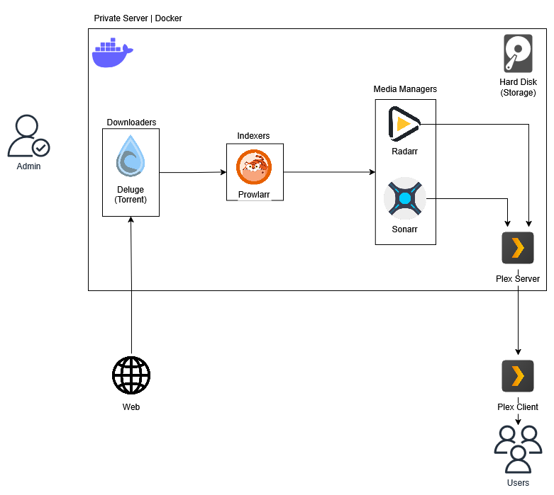

<p class="emphasized">This project showcases experience in server management, as well as making use of existing open source tools to fix real world problems.</p> 


# Media Server

Watching movies and TV in the last few years has turned from an enjoyable hobby into an endless chase for the right streaming service subscription. [This comedic video](https://www.youtube.com/watch?v=yvhv7bgmz64) showcases fairly well what I mean.

On this project I will showcase one way to take back a bit of the control over this hobby by setting up your own private media service.

## Sections
Each section of this project will detail a part of the media automation process. In general:
- **File management and storage** - You'll need somewhere to store your media.

- **Downloading** - You'll need some way to get your hands on the media you want to watch.

- **Monitoring** - You'll need to know when new episodes from the stuff you are watching release, and a way to automate the acquisition of those episodes.

- **Streaming** - You'll need some program to view the media you previously downloaded, hopefully anywhere you want.





## Piracy

While this entire process could, with some changes, be applied for pirating media, this project will focus on 

1. Automatically downloading free, publicly available media and
2. Streaming your own, bought and payed for, media


# File Management

First thing you'll need is a way to manage your files.

I generally leave my files in a folder structure like this, in my server's HDD:

```
data
├── torrents
│   ├── books
│   ├── movies
│   ├── music
│   └── tv
└── media
    ├── books
    ├── movies
    ├── music
    └── tv
```

<p class="emphasized">The folder structure is important as you'll need to configure each software to access these folders properly.<p>


