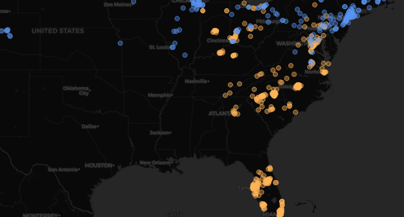

This project showcases knowledge in Data Analysis and Engineering using PostgreSQL, as well as visualization using Grafana (and sometimes very high efficiency at being an idiot).
 

# US Accidents Dashboard

A dashboard usually refers to group of contents that help you visualize certain aspects of one (or more) datasets. These can include anything from plain text to detailed maps.

One of these days during a job interview I noticed that although I have made my fair share of graphs and tables to aid in data visualization in the past, I never took the time to properly create a dashboard with a lot of info on a specific subject. So here we are.

One tool you could use to create dashboards is **Grafana**, and that is what I am using.

To those of you familiar with Grafana, yes, I know, its mostly used for visualization of time series data. Its also very commonly used for monitoring clusters and etc. I'm using it anyway (partly because I want to familiarize myself with the tool, partly because I just think its a good tool to process data in general, so why not right?)

To those of you unfamiliar with Grafana, it is a data visualization software that allows you to import data sources, query them, and create pretty and easy to understand dashboards, save them, and share them.

I'm gonna leave you with this image that took about 1 line of SQL code - and not much else - to generate. It shows US east-coast traffic accidents separated by local temperature on the moment of the accident.

This is just a super simple example but I hope it illustrates the power of Grafana for making data visualization quick and easy.

## Data Sources

 ~Edit: I sort of failed to bring this up on my first draft of this document, but I'm getting my data from Kaggle (link at the end of the project), its a 3GB CSV file. 
 

Knowing I wanted to use Grafana at the start of this project made my first few steps very clear.

Grafana uses "data sources" to pull data from. These data sources include pretty much anything you can think of. MySQL, DynamoDB, Cloudwatch, InfluxDB, Google Analytics, JSON... If its slightly famous and it holds data, there'll be a community plugin for it.

So lets narrow this down a bit, looking through my options there were a few that sparked my interest:
- **Infinity** (CSV handler) - It would have been fun to just drag and drop my US Accidents CSV into Grafana and be done with it. Even if it wasn't the most efficient way to do it, it would have been very nice to skip this step entirely. Sadly my server has 2GBs of RAM. 3GB of data, 2 GB of ram, Infinity loads it all into memory (from what I know), so that's that option out of the window.

*Ha! But you think that simple impossibilities would stop be from trying? No! I still wasted about an hour downloading the dataset into my server, serving the CSV file - through a python server I set up just for this - to my Grafana instance, and then realising that yes! In fact, its not f***ing possible ;-;*

- **DynamoDB** (Amazon's database service)- Would have been cool to have all of this on the cloud, but as I've talked about in other projects of mine, DynamoDB is not great for data analysis, and I'll guess 3GB of data with lots of accesses (to refresh my dashboard) all day will cost me more money than I'm willing to pretend I own.

- **JSON API** - I'm going to be real with you, I'm unsure how this option works. I didn't go with it because I realized it just made sense to use the tools I'm most familiar with, but it would have been pretty fun to try and serve data from my API into Grafana overtime and sort of "emulate" in real time (from ~10 years ago) the accidents happening on my dashboard.

- **PostgreSQL** - I've used Postgres for lots of other projects, I know how it works, I've accessed info from it in Grafana before. I know how that works. If this process of extracting and loading data was the entirety of this project I might have studied other tools a bit more in-depth, but I want to actually be able to design my dashboard and make cool graphs and stuff. So, awesome! Well, except for the fact that transfering data from the CSV to Postgres will still be a bit of a hassle but eh... tough luck.

## CSV to Postgres

So, first things first, can't insert the data into our postgres database if we don't have a postgres database.

I'm not gonna detail the whole process but:
- I loaded the CSV data into a python pandas DataFrame (gladly, my personal computer has 12GB of ram, so nothing to worry about here)
- I went through all the columns (gladly the dataset on Kaggle has all collumns' meanings properly explained) and selected the ones I found usefull - By the way, that trimmed about half the size of my dataset ^^'
- I had a postgres server running in a Linux Container already (for my other Postgres/Grafana project) so I used that
- I created a postgres table with columsn matching the ones on my DataFrame
- I spent about an hour trying different ways to load the data from my computer into postgres. What finally did it was stumbling on a random comment on stackoverflow detailing a function to do it. took about 6 minutes to transfer the entire dataset (most of the time was honestly just waiting, because some of the attempt took 5 minutes, one took 20, etc).
- At the end of the process I had all data on postgres :D

If anyone is wondering the exact tools I used: Python, Pandas and Sqlalchemy.
Pandas has a `to_sql` function that can be used with sqlalchemy's "engines".
All that + a custom made method from StackOverflow.

## Materialized Views

## Resources

- [Dataset on Kaggle](https://www.kaggle.com/datasets/sobhanmoosavi/us-accidents/data)
